# 使用手册

## 运行指南

### 设备模拟器

设备模拟器在`client_simulator`目录下：

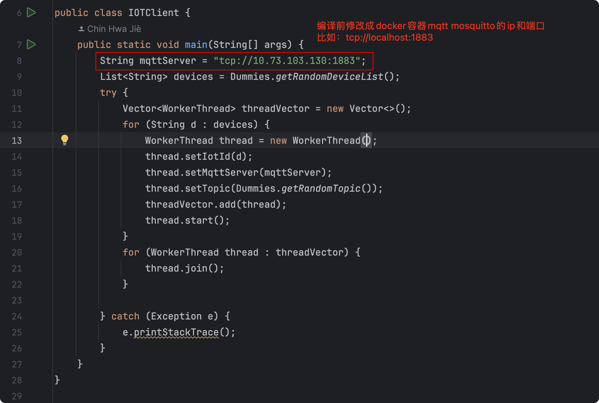

1. 代码编译 `mvn clean package`
2. 运行 `java -jar iotclient-1.0.0.jar`

### 应用

导航到`src`目录，然后`bash deploy.sh`，这个脚本只支持MacOS 和 Linux

部署成功的话应该是长这样的：

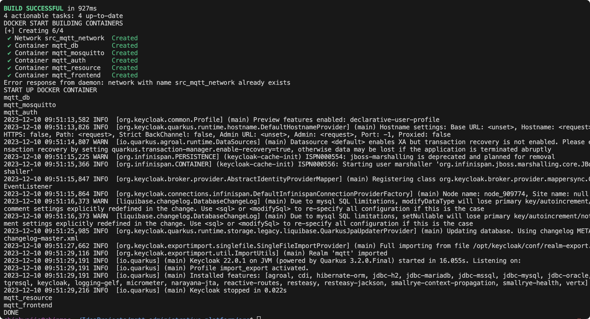

不确定的话`docker ps`检查一下确保5个容器都在运行中

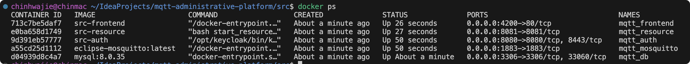

到浏览器输入http://localhost:4200

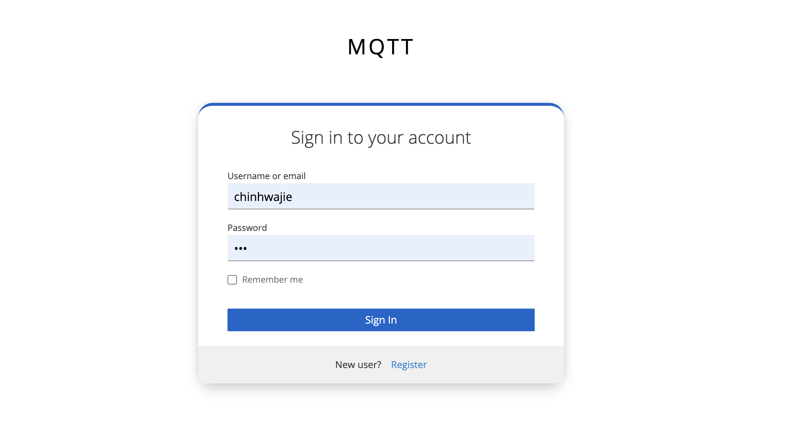

如果看到此画面，说明应该是成功的了。

### 如果要关闭或删除

直接`docker-compose down`就行了

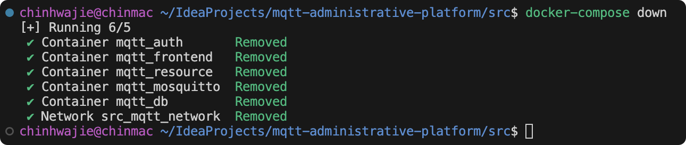

## 注册/登录

在浏览器输入前端的网址，会自动跳转到验证服务器的页面

### 登录

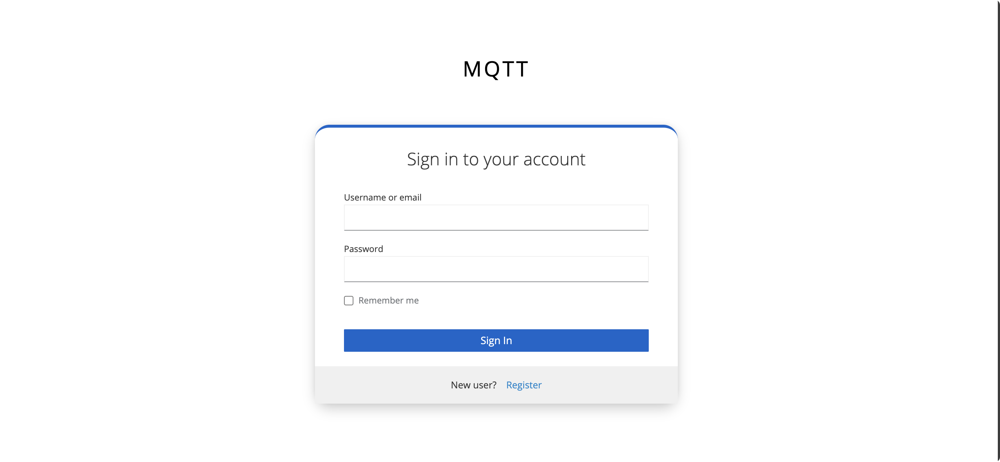

### 注册

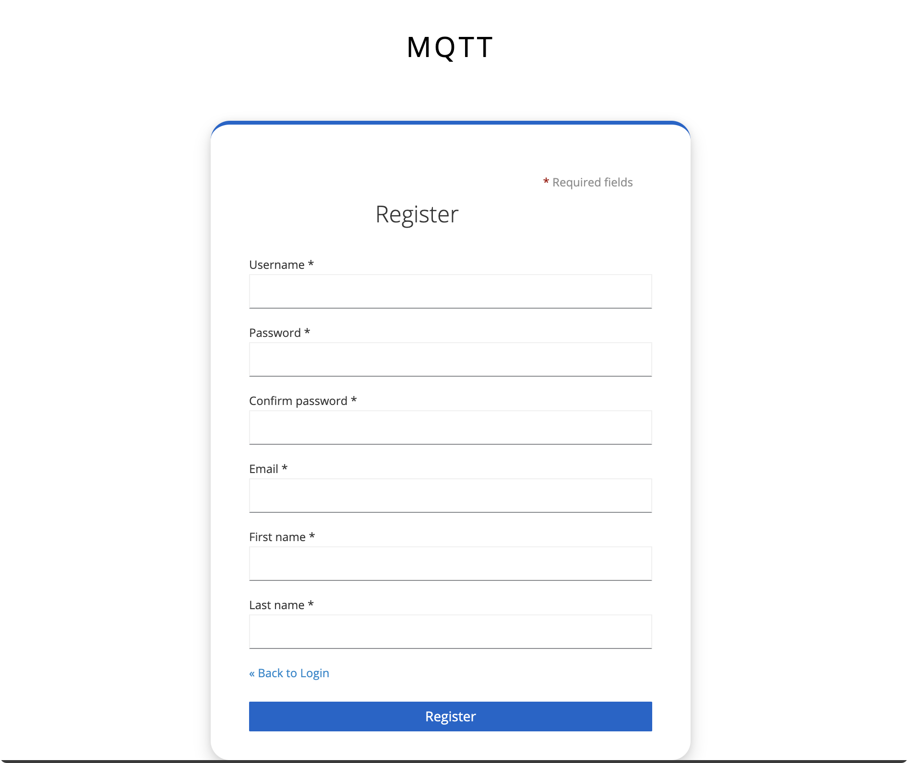

## 主页

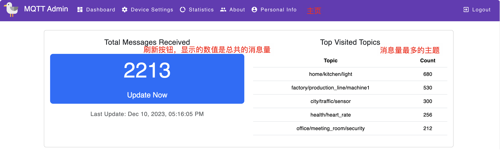

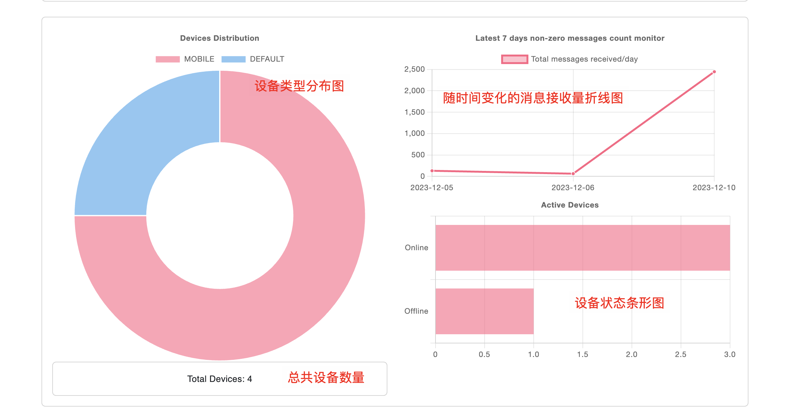

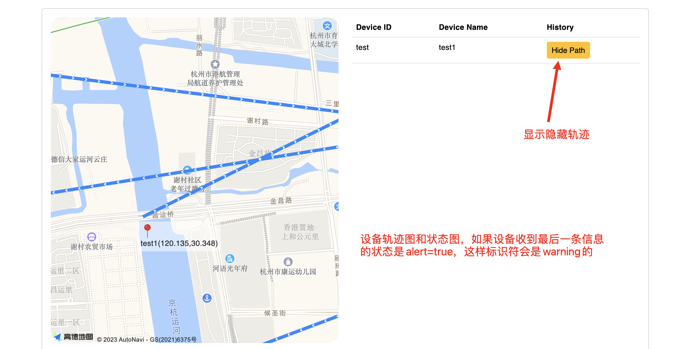

## 设备管理

### 设备查询

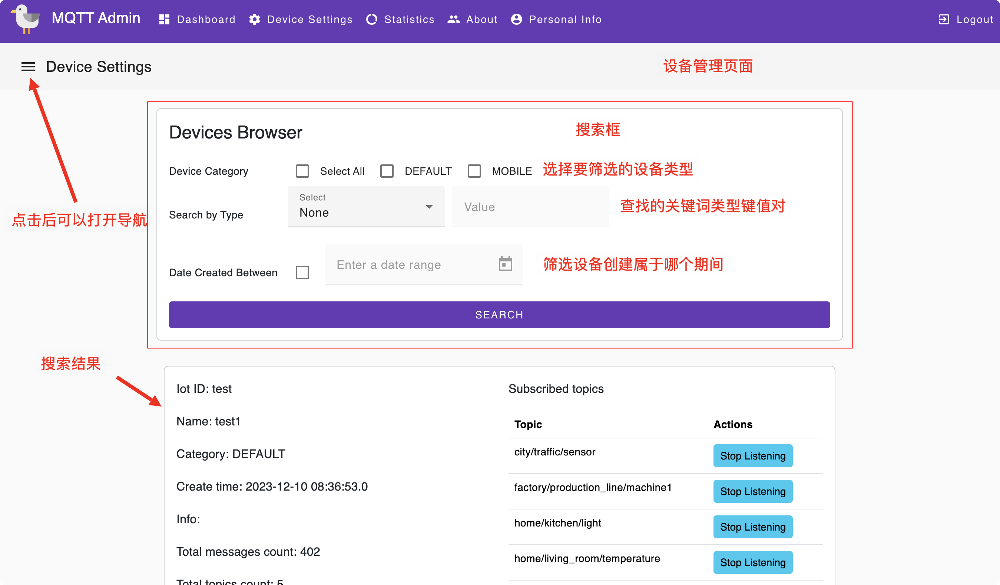

### 创建设备

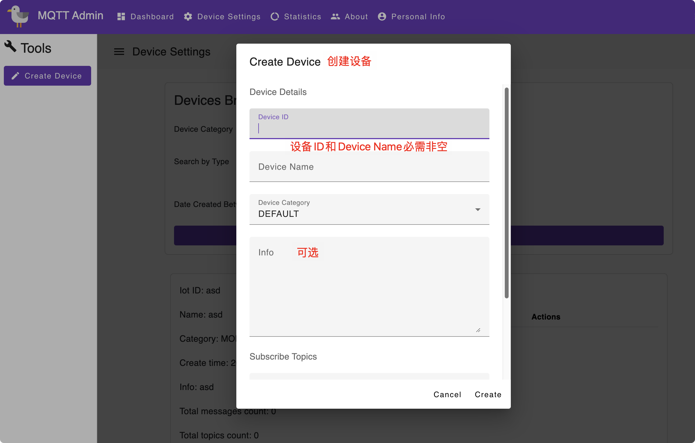

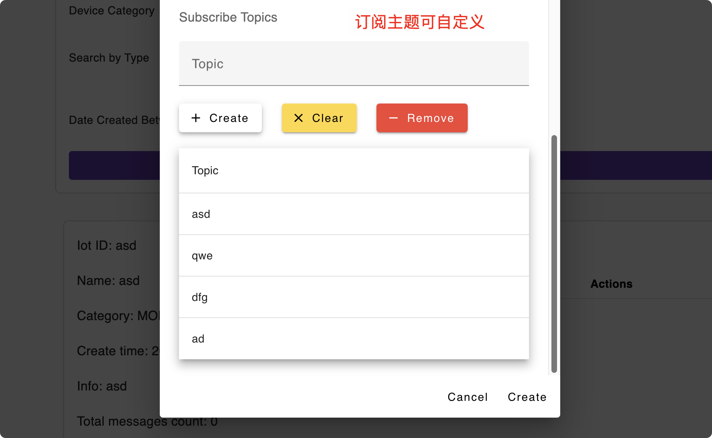

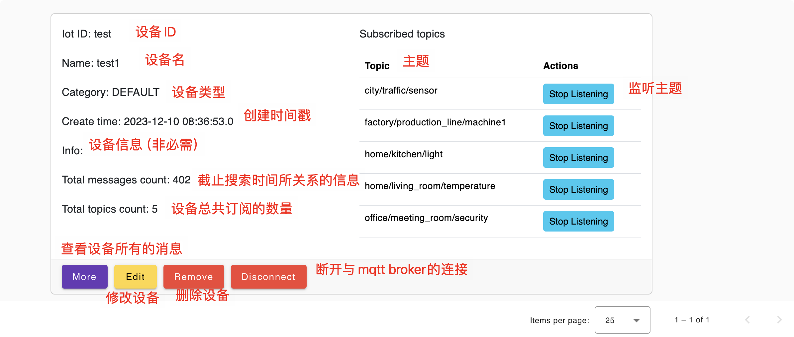

### More

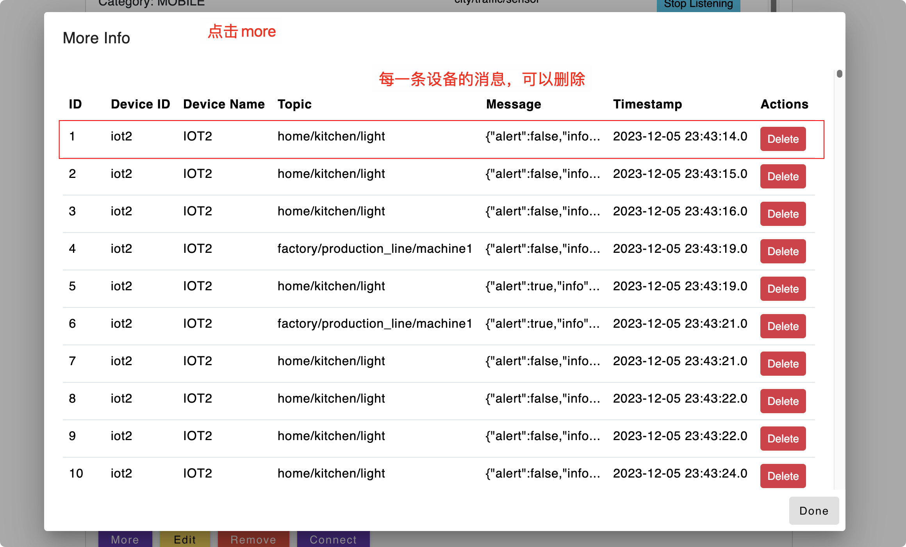

### 修改设备

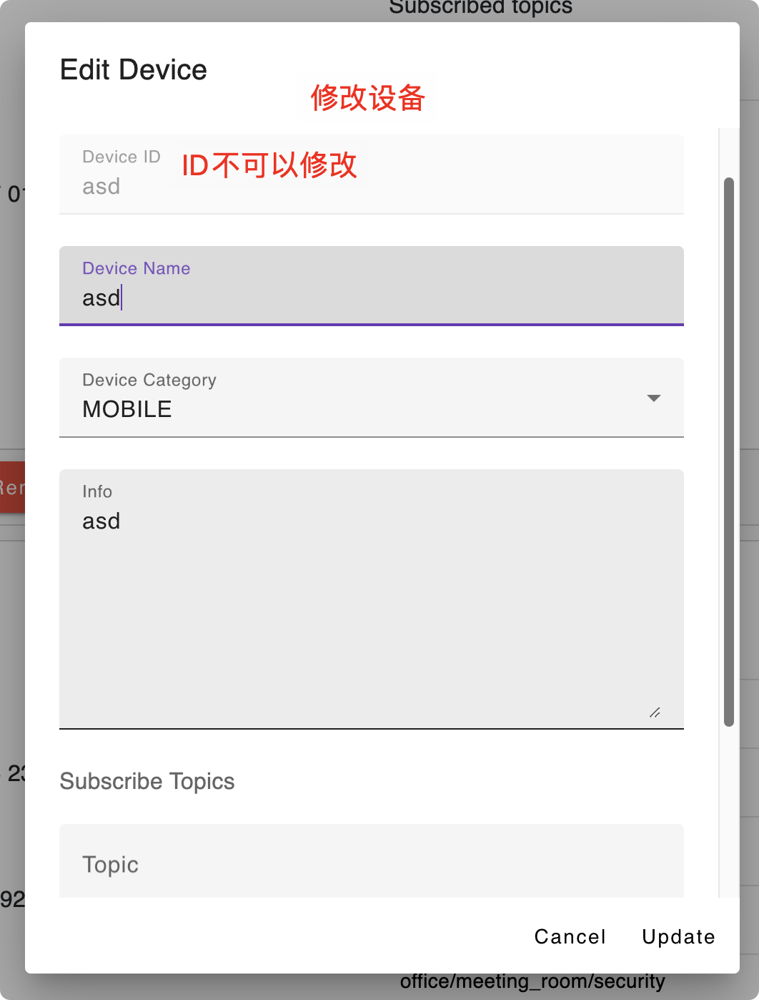

## Statistics页面

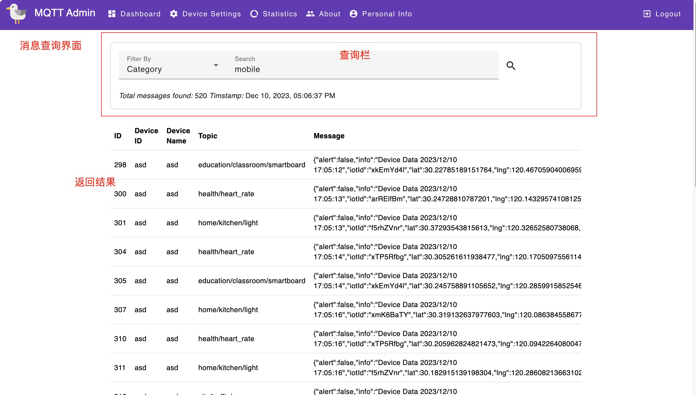

### 选项

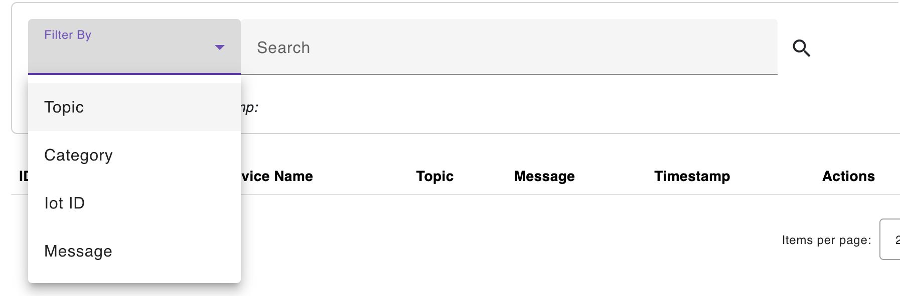

## 关于

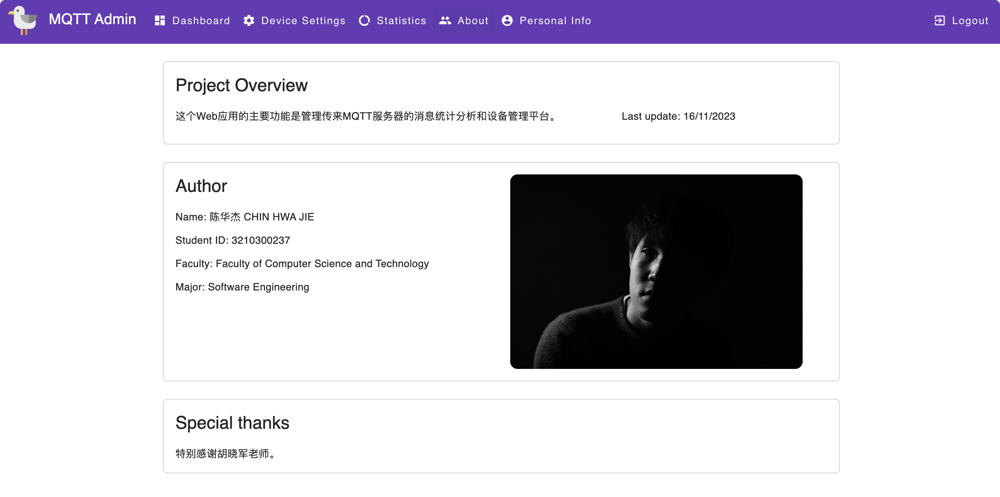

## Personal Info

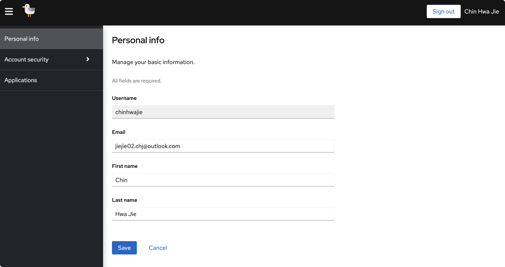

# 开发体会

这是个人开发过最大的项目，虽然不是特别难，但是工作量非常多，而且调试花了一定的时间。个人觉得最挑战的部分还是多条线程在连接mqtt，这样才可以同时监听多个主题，同时获取多个主题的消息，其余大部分的工作这是前端的样式排版。我也觉得graphql有一个有点就是，设计的接口可以少很多，对于查询的接口，基本上几个就可以完成大部分的查询工作。但是需要对数据库读写的操作，个人认为还是用REST方式会更适合，所以以后可能会考虑结合使用，这样可以缩短开发周期。

第二部分是我觉得我在异常处理这部分学到了很多，特别是前后端异常信息的传递，但在作业里面呈现的不多。主要是因为后来才发现原来springboot有更简单的异常处理方式，graphql也有自己的异常处理方式，结合起来功能就很强大了。后端改起来工作量少很多，但是前端修改异常处理的话代码量就会增加很多，所以最后只是在后端强化了异常处理，而前端保留了原来的，虽然会判断异常结果，但是用户没法知道为什么失败或成功，这是需要改进的部分。

# 小结

此部分可以参考github的commit吧～
