# 使用手册

## 运行指南

### 设备模拟器

设备模拟器在`client_simulator`目录下：

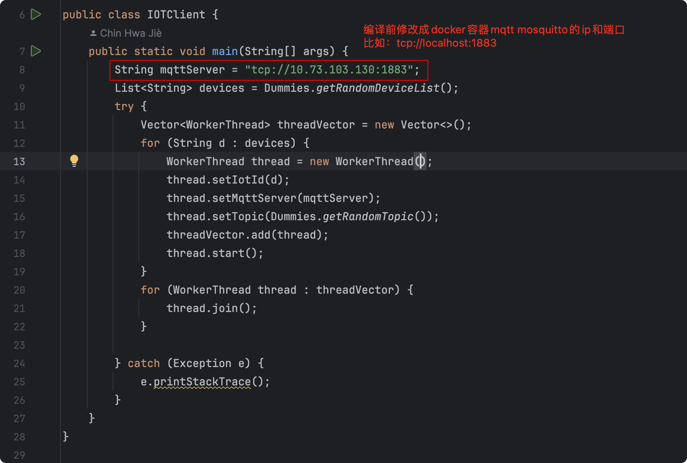

1. 代码编译 `mvn clean package`
2. 运行 `java -jar iotclient-1.0.0.jar`

### 应用

导航到`src`目录，然后`bash deploy.sh`，这个脚本只支持MacOS 和 Linux

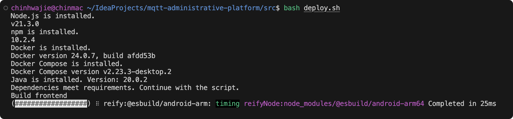

部署成功的话应该是长这样的：

不确定的话`docker ps`检查一下确保5个容器都在运行中

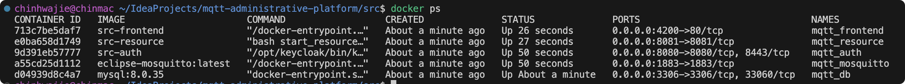

到浏览器输入http://localhost:4200

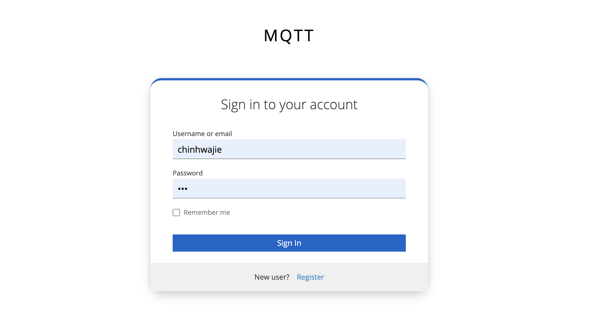

如果看到此画面，说明应该是成功的了。

### 如果要关闭或删除

直接`docker-compose down`就行了

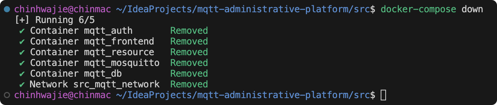

## 注册/登录

在浏览器输入前端的网址，会自动跳转到验证服务器的页面

### 登录

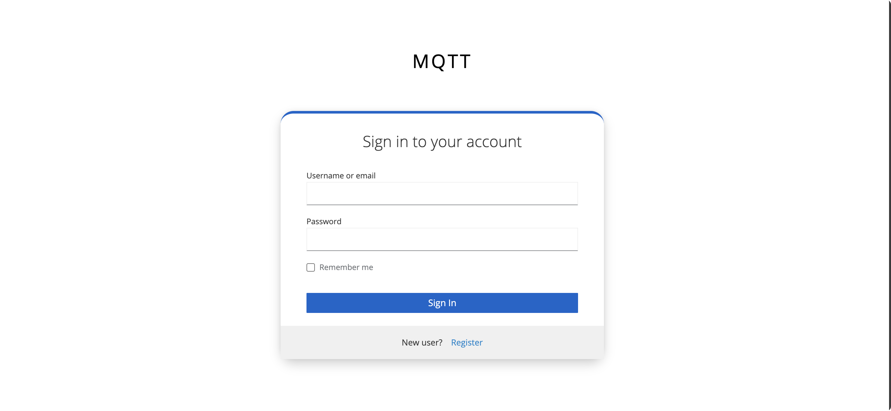

### 注册

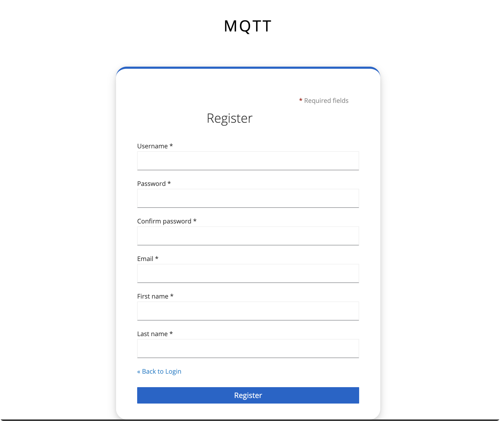

## 主页

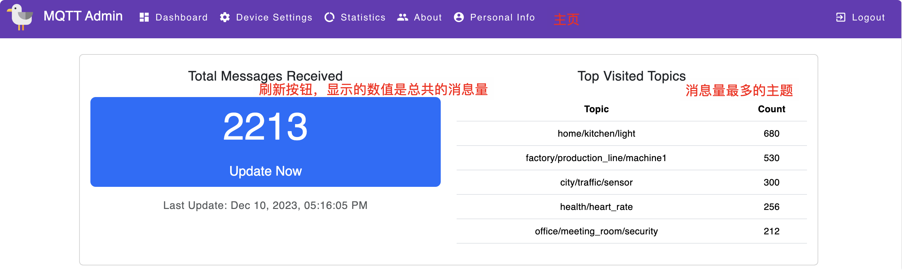

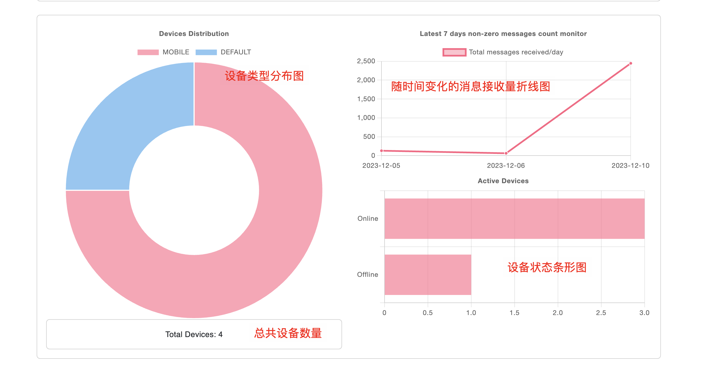

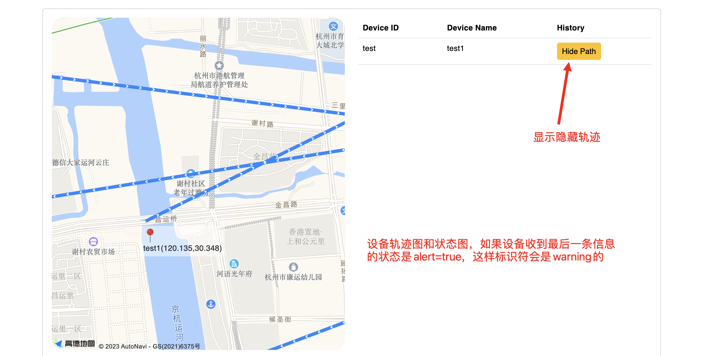

## 设备管理

### 设备查询

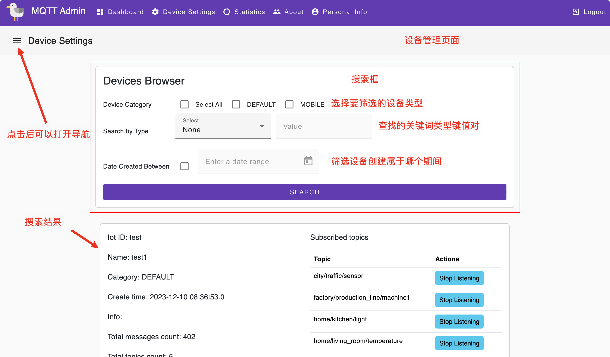

### 创建设备

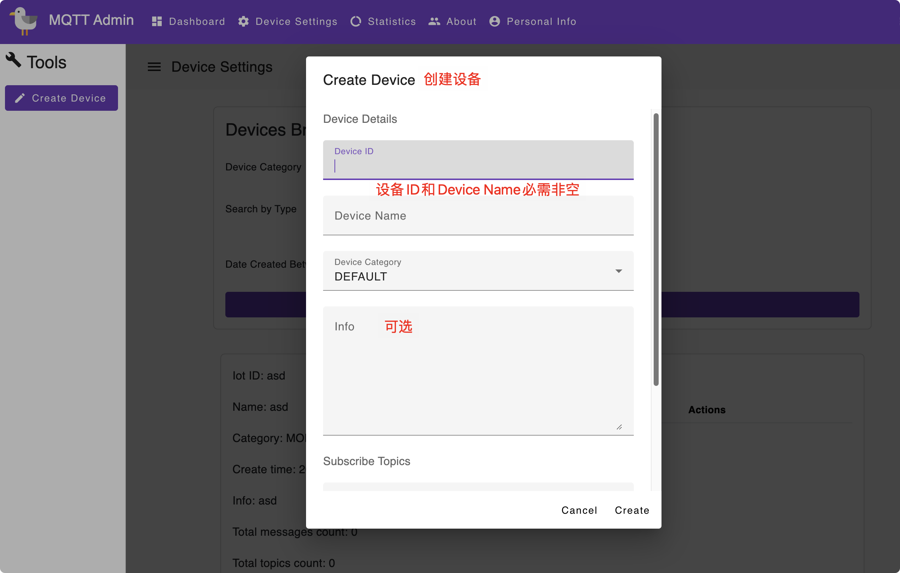

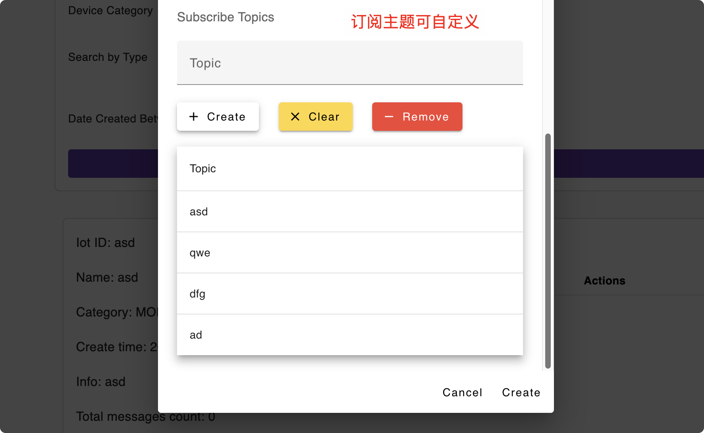

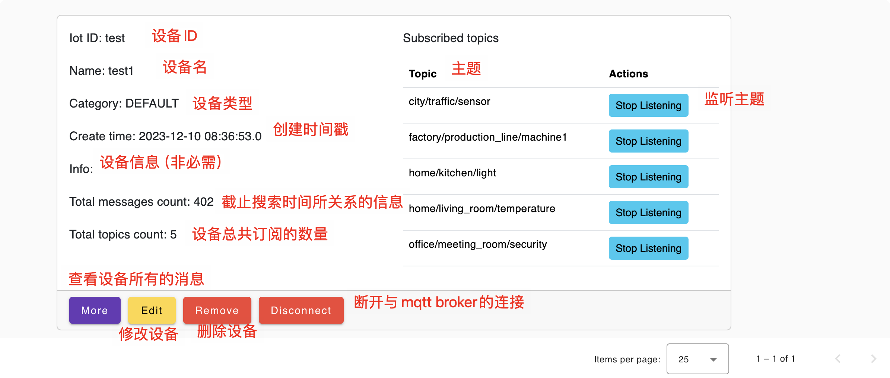

### More

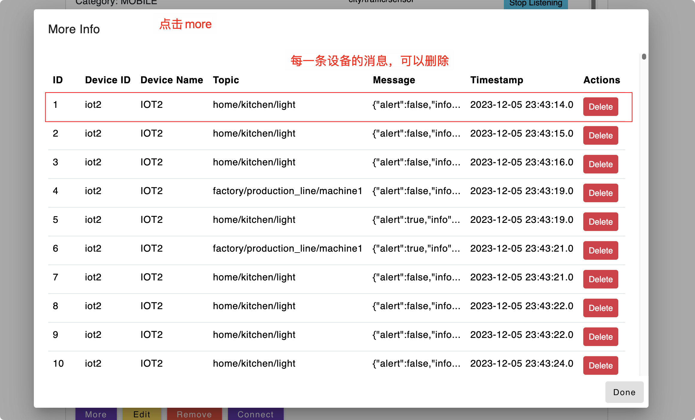

### 修改设备

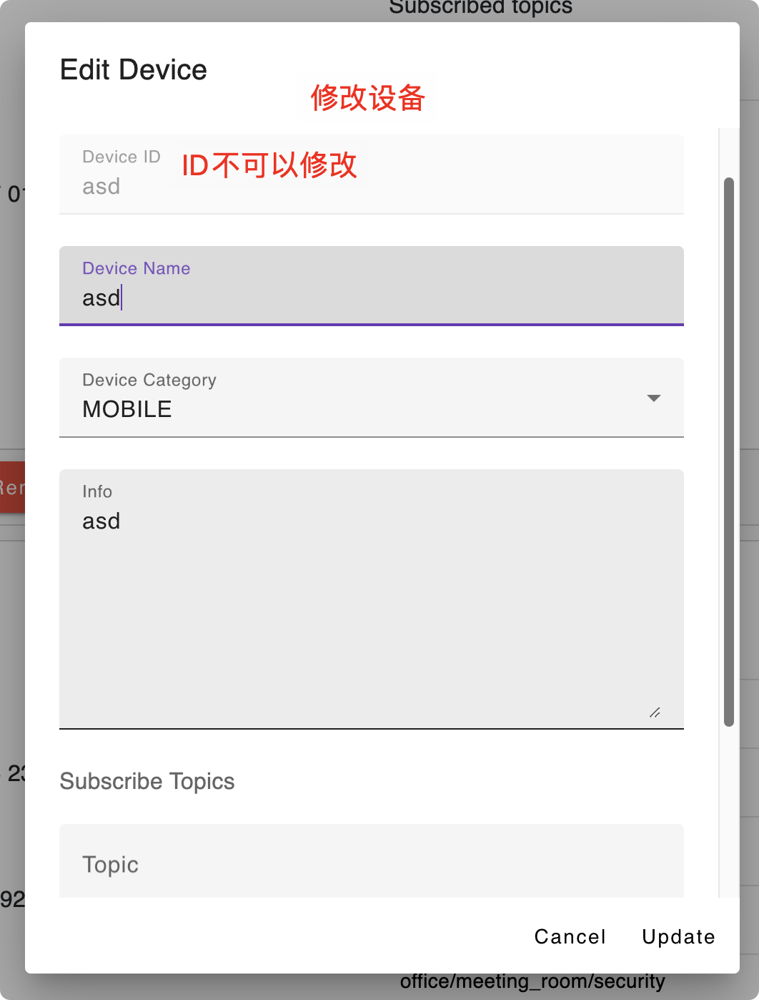

## Statistics页面

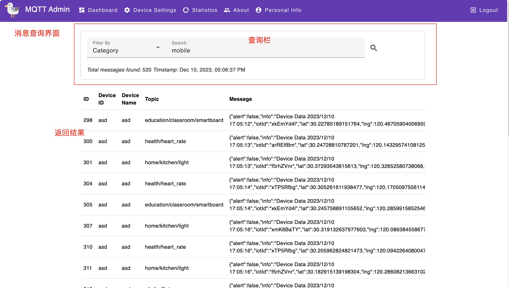

### 选项

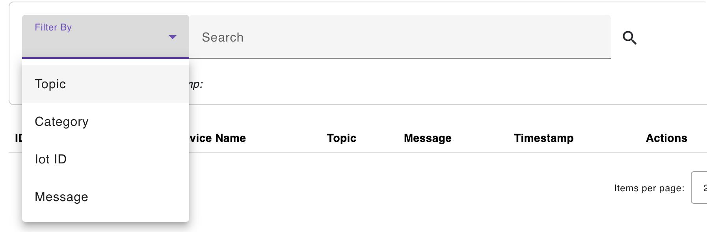

## 关于

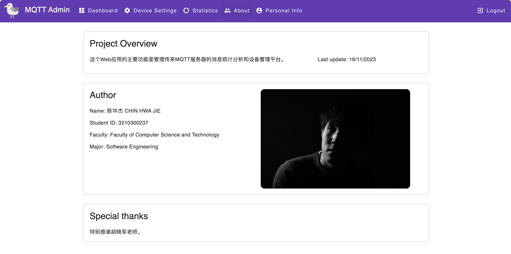

## Personal Info

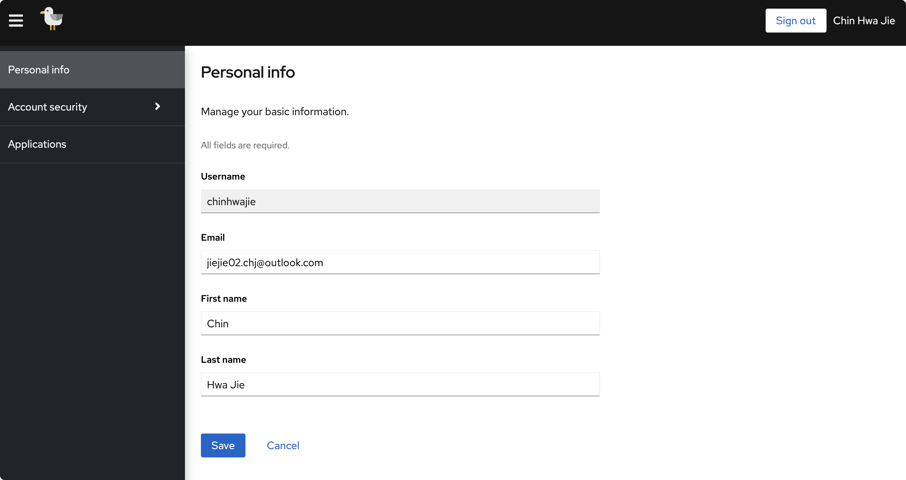

